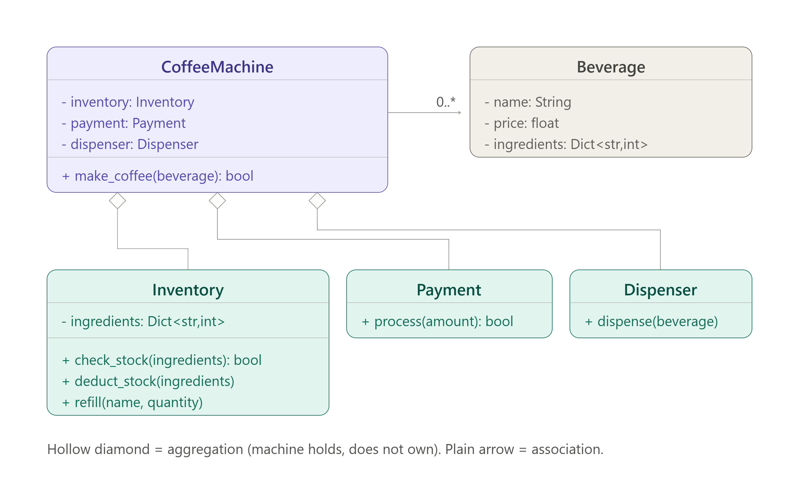

# Coffee Machine

**Exercise:** first object-oriented design exercise. Identify the classes, their responsibilities, and the relationships between them.

## Requirements

- Multiple beverages
- Ingredients
- Inventory
- Payment
- Dispensing
- Refill

---

## Class Diagram



---

## Classes and Responsibilities

### CoffeeMachine

**Responsibility:** orchestrate a purchase. It sequences the sub-systems; it performs no stock arithmetic, no payment logic, and no dispensing of its own.

| Visibility | Attribute | Type |
|---|---|---|
| `-` | `inventory` | `Inventory` |
| `-` | `payment` | `Payment` |
| `-` | `dispenser` | `Dispenser` |

| Visibility | Method | Returns |
|---|---|---|
| `+` | `make_coffee(beverage: Beverage)` | `bool` |

---

### Beverage

**Responsibility:** describe a product on the menu — what it is called, what it costs, and what it is made of.

| Visibility | Attribute | Type |
|---|---|---|
| `-` | `name` | `String` |
| `-` | `price` | `float` |
| `-` | `ingredients` | `Dict<String, int>` |

---

### Inventory

**Responsibility:** own the ingredients actually **in stock**, answer whether a beverage can be made, and adjust stock levels. Covers the *Ingredients* and *Refill* requirements.

| Visibility | Attribute | Type |
|---|---|---|
| `-` | `ingredients` | `Dict<String, int>` |

| Visibility | Method | Returns |
|---|---|---|
| `+` | `check_stock(required: Dict<String, int>)` | `bool` |
| `+` | `deduct_stock(required: Dict<String, int>)` | `void` |
| `+` | `refill(name: String, quantity: int)` | — |

---

### Payment

**Responsibility:** collect and validate money for a given amount. Stateless service — it knows nothing about beverages or stock.

| Visibility | Method | Returns |
|---|---|---|
| `+` | `process(amount: float)` | `bool` |

---

### Dispenser

**Responsibility:** perform the physical delivery of a prepared beverage. Isolates hardware from business logic.

| Visibility | Method | Returns |
|---|---|---|
| `+` | `dispense(beverage: Beverage)` | `void` |

---

## Relationships

| From | To | Relationship | Notation | Multiplicity |
|---|---|---|---|---|
| CoffeeMachine | Inventory | Aggregation | `◇` hollow diamond | `1` → `1` |
| CoffeeMachine | Payment | Aggregation | `◇` hollow diamond | `1` → `1` |
| CoffeeMachine | Dispenser | Aggregation | `◇` hollow diamond | `1` → `1` |
| CoffeeMachine | Beverage | Association | plain line | `1` → `0..*` |

**Why aggregation and not composition.** The machine does not create its sub-systems — the caller builds them and passes them in through the constructor, so the machine does not control their lifecycle. The same `Payment` instance could be handed to another machine, and a test can supply a substitute. A hollow diamond, not a filled one.

**Why association for CoffeeMachine → Beverage.** Unchanged from v1. The machine offers a menu of beverages but does not own their definitions — a beverage is defined in configuration and loaded in. The `0..*` allows a machine with an empty menu.

---

## Purchase Flow

The responsibility split, seen in motion:

```text
CoffeeMachine.make_coffee(beverage)
    │
    ├─► Inventory.check_stock(beverage.ingredients)   → can we make it?
    │
    ├─► Payment.process(beverage.price)               → take the money
    │
    ├─► Inventory.deduct_stock(beverage.ingredients)  → consume ingredients
    │
    └─► Dispenser.dispense(beverage)                  → deliver it
```

Every step is a **message** to an object that owns the relevant state. The `CoffeeMachine` never touches `inventory.ingredients` directly — see [[WhyOOP]].

The four steps are unchanged from v1. The workflow was never the problem — only what the machine depended on, and who built the objects it received.

---

## Requirements Coverage

| Requirement | Where it lives |
|---|---|
| Multiple beverages | `Beverage` as data — a new drink is new data, not new code |
| Ingredients | `Beverage.ingredients` (required) and `Inventory.ingredients` (in stock) |
| Inventory | `Inventory.check_stock()` / `deduct_stock()` |
| Payment | `Payment.process()` |
| Dispensing | `Dispenser.dispense()` |
| Refill | `Inventory.refill()` |

---

## Related

- [[SOLID-Review]] — SOLID analysis of this design
- [[UML-Basics]] — notation reference for the diamonds and multiplicities
- [[WhyOOP]] — object relationships and message passing
