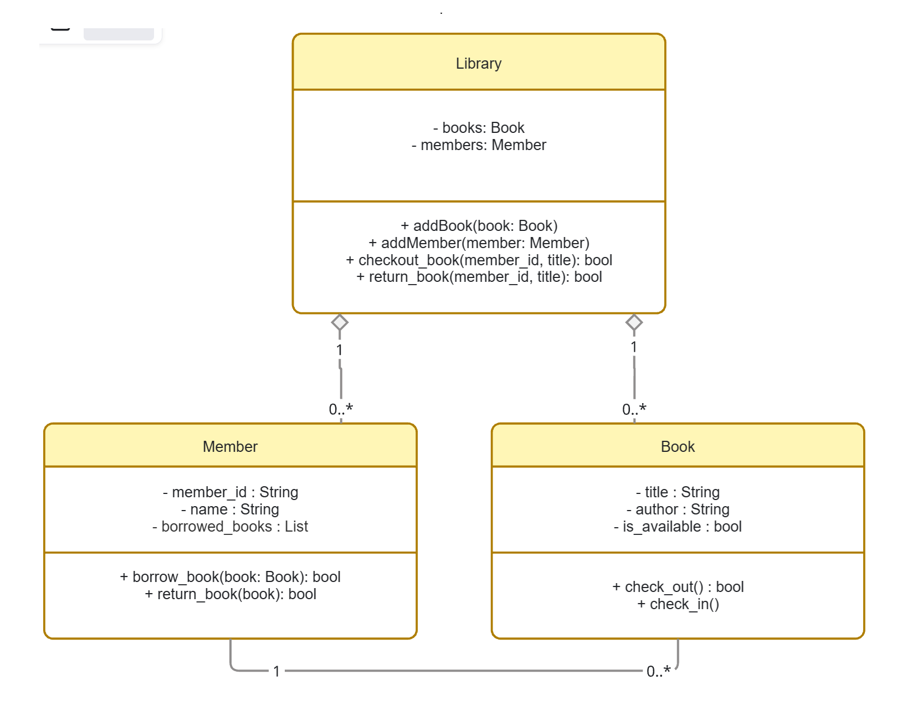

# Library Management System — Low-Level Design

A class-level design for a simple library system: the library holds books and members, members borrow and return books, and each book tracks its own availability.

---

## Class Diagram



---

## Classes

### Library

The container and coordinator. Owns the collections and exposes the operations a caller actually performs.

| Visibility | Attribute | Type |
|---|---|---|
| `-` | `books` | `Book` |
| `-` | `members` | `Member` |

| Visibility | Method | Returns |
|---|---|---|
| `+` | `addBook(book: Book)` | — |
| `+` | `addMember(member: Member)` | — |
| `+` | `checkout_book(member_id, title)` | `bool` |
| `+` | `return_book(member_id, title)` | `bool` |

---

### Member

Represents a borrower and the set of books they currently hold.

| Visibility | Attribute | Type |
|---|---|---|
| `-` | `member_id` | `String` |
| `-` | `name` | `String` |
| `-` | `borrowed_books` | `List` |

| Visibility | Method | Returns |
|---|---|---|
| `+` | `borrow_book(book: Book)` | `bool` |
| `+` | `return_book(book: Book)` | `bool` |

---

### Book

Represents a book and owns its own availability state.

| Visibility | Attribute | Type |
|---|---|---|
| `-` | `title` | `String` |
| `-` | `author` | `String` |
| `-` | `is_available` | `bool` |

| Visibility | Method | Returns |
|---|---|---|
| `+` | `check_out()` | `bool` |
| `+` | `check_in()` | — |

---

## Relationships

| From | To | Relationship | Notation | Multiplicity |
|---|---|---|---|---|
| Library | Member | Aggregation | `◇` hollow diamond | `1` → `0..*` |
| Library | Book | Aggregation | `◇` hollow diamond | `1` → `0..*` |
| Member | Book | Association | plain line | `1` → `0..*` |

**Why aggregation and not composition:** the hollow diamond says the `Library` *holds* books and members but does not own their lifecycle. A `Book` or a `Member` can be constructed independently and passed in via `addBook()` / `addMember()`, and both continue to exist if the `Library` object is destroyed.

**The Member–Book association** is a plain line: one member may hold zero or many books at a time. Neither owns the other.

---

## Responsibility Split

The three `checkout`-flavoured methods are a **delegation chain**, not duplication:

```text
Library.checkout_book(member_id, title)
        │  looks up the member and the book, coordinates the operation
        ▼
Member.borrow_book(book)
        │  records the book in borrowed_books
        ▼
Book.check_out()
           flips is_available to False
```

Each object changes only its own state — the `Library` never writes `book.is_available` directly, and the `Member` never reaches into the `Book`. This is message passing applied to a concrete design: see [[WhyOOP]].

`return_book` follows the mirrored path through `Member.return_book()` and `Book.check_in()`.

---

## Skeleton

Transcribed directly from the diagram — signatures only.

```python
class Book:
    def __init__(self, title: str, author: str):
        self._title = title
        self._author = author
        self._is_available = True

    def check_out(self) -> bool:
        """Mark unavailable. Returns False if already checked out."""

    def check_in(self) -> None:
        """Mark available again."""


class Member:
    def __init__(self, member_id: str, name: str):
        self._member_id = member_id
        self._name = name
        self._borrowed_books: list[Book] = []

    def borrow_book(self, book: Book) -> bool:
        """Add to borrowed_books if the book can be checked out."""

    def return_book(self, book: Book) -> bool:
        """Remove from borrowed_books and check the book back in."""


class Library:
    def __init__(self):
        self._books: list[Book] = []
        self._members: list[Member] = []

    def addBook(self, book: Book) -> None: ...

    def addMember(self, member: Member) -> None: ...

    def checkout_book(self, member_id: str, title: str) -> bool:
        """Find member and book, then delegate to Member.borrow_book()."""

    def return_book(self, member_id: str, title: str) -> bool:
        """Find member and book, then delegate to Member.return_book()."""
```

---

## Related

- [[WhyOOP]] — object relationships and message passing
- [[UML-Basics]] — notation reference for the symbols used above
