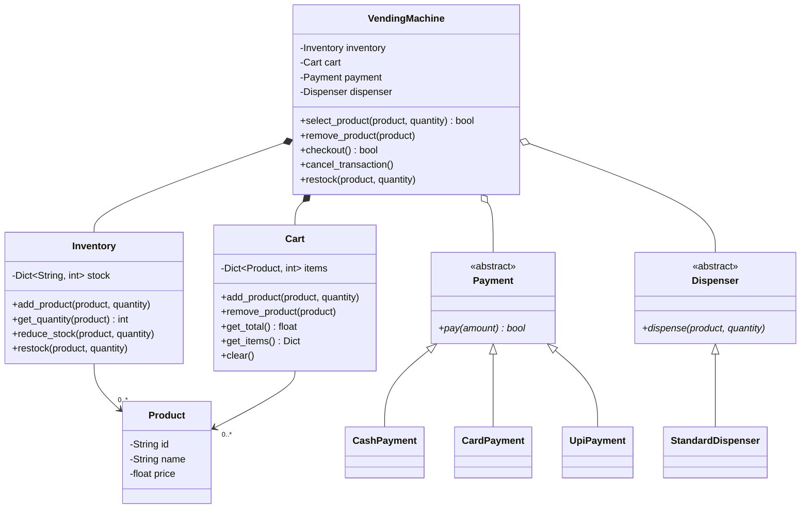

# Vending Machine — Low-Level Design

**Exercise:** identify the classes, their responsibilities, and the relationships between them. This is the third machine-style design, and the first one where the `Payment` and `Dispenser` abstractions are in place **from the start** rather than added as a fix — see [[SOLID-Review]] for the Coffee Machine, where the need for them was the main finding.

## Requirements

- Multiple products
- Inventory management
- Payment
- Product dispensing
- Restocking
- Cancel transaction

---

## Finding the Classes

Before naming classes, list what the machine actually does:

| The machine must… | Suggests |
|---|---|
| stock products and track how many are left | `Inventory` |
| let a customer pick one or more items | `Cart` |
| know what each item is and costs | `Product` |
| total up the selection | `Cart.get_total()` |
| take money by cash, card, or UPI | `Payment` (abstract) |
| physically deliver the goods | `Dispenser` (abstract) |
| abandon a selection before paying | `VendingMachine.cancel_transaction()` |
| let an operator refill it | `Inventory.restock()` |
| sequence all of the above | `VendingMachine` |

The last row is the important one. `VendingMachine` earns its place as a **coordinator**, not as a container for the logic — every noun above it owns its own state.

---

## Class Diagram




---

## Classes and Responsibilities

The test applied throughout: *if this requirement changes, does the change land in exactly one class?*

### VendingMachine

**Responsibility:** sequence a purchase. It owns the workflow and nothing else — no stock arithmetic, no price arithmetic, no payment logic, no hardware.

| Visibility | Attribute | Type |
|---|---|---|
| `-` | `inventory` | `Inventory` |
| `-` | `cart` | `Cart` |
| `-` | `payment` | `Payment` |
| `-` | `dispenser` | `Dispenser` |

| Visibility | Method | Returns |
|---|---|---|
| `+` | `select_product(product: Product, quantity: int)` | `bool` |
| `+` | `remove_product(product: Product)` | — |
| `+` | `checkout()` | `bool` |
| `+` | `cancel_transaction()` | — |
| `+` | `restock(product: Product, quantity: int)` | — |

> `restock()` is a pure pass-through to `Inventory`. That is not a smell — it is the machine presenting one public surface to two different actors (customer and operator) while the logic stays in one place.

---

### Product

**Responsibility:** describe a purchasable item. Pure data — it knows nothing about stock, carts, payment, or dispensing.

| Visibility | Attribute | Type |
|---|---|---|
| `-` | `id` | `String` |
| `-` | `name` | `String` |
| `-` | `price` | `float` |

---

### Inventory

**Responsibility:** own the stock levels. Answer how much is left, consume stock on a sale, and accept refills. Covers the *Inventory management* and *Restocking* requirements.

| Visibility | Attribute | Type |
|---|---|---|
| `-` | `stock` | `Dict<String, int>` |

| Visibility | Method | Returns |
|---|---|---|
| `+` | `add_product(product: Product, quantity: int)` | — |
| `+` | `get_quantity(product: Product)` | `int` |
| `+` | `reduce_stock(product: Product, quantity: int)` | — |
| `+` | `restock(product: Product, quantity: int)` | — |

`add_product` introduces a **new** SKU to the machine; `restock` increases an **existing** one. Keeping them separate avoids the naming collision flagged in [[SOLID-Review]], where `add_ingredient()` meant two unrelated things depending on the class.

> **Keying detail.** `stock` is keyed by `product.id`, not by the `Product` object. Keying by object works in Python only if `Product` defines `__eq__` and `__hash__`, and it silently breaks the moment two equal-but-distinct `Product` instances are constructed. The `id` field exists precisely to be the key.

---

### Cart

**Responsibility:** hold the customer's current selection and total it. This is the class the Coffee Machine design did not need — one coffee, one transaction. Multiple products means the selection is itself state, and state needs an owner.

| Visibility | Attribute | Type |
|---|---|---|
| `-` | `items` | `Dict<Product, int>` |

| Visibility | Method | Returns |
|---|---|---|
| `+` | `add_product(product: Product, quantity: int)` | — |
| `+` | `remove_product(product: Product)` | — |
| `+` | `get_total()` | `float` |
| `+` | `get_items()` | `Dict<Product, int>` |
| `+` | `clear()` | — |

```text
Coke   × 2  → ₹80
Chips  × 1  → ₹20
------------------
Total       → ₹100
```

The distinction that makes this design work:

> **Inventory** is what the machine *has*. **Cart** is what the customer *wants*.

They are never the same collection, and they change for entirely different reasons.

---

### Payment *(abstract)*

**Responsibility:** collect money for an amount. Abstract because a real machine takes cash, card, and UPI, and each is a different rail with a different failure mode.

| Visibility | Method | Returns |
|---|---|---|
| `+` | `pay(amount: float)` *abstract* | `bool` |

Implementations: `CashPayment`, `CardPayment`, `UpiPayment`.

`VendingMachine` depends on the abstraction, never on a concrete rail — [[05-DIP]]. Adding a fourth rail is a new subclass, not an edit to the machine — [[02-OCP]].

---

### Dispenser *(abstract)*

**Responsibility:** physically deliver a product. Abstract so hardware can be swapped, and so tests can run against a fake.

| Visibility | Method | Returns |
|---|---|---|
| `+` | `dispense(product: Product, quantity: int)` *abstract* | — |

Implementations: `StandardDispenser` (and a `MockDispenser` for tests).

One implementation today does not make the abstraction premature — it makes the machine testable without hardware, which is reason enough on its own.

---

## Relationships

| From | To | Relationship | Notation | Multiplicity |
|---|---|---|---|---|
| VendingMachine | Inventory | Composition | `◆` filled diamond | `1` → `1` |
| VendingMachine | Cart | Composition | `◆` filled diamond | `1` → `1` |
| VendingMachine | Payment | Aggregation | `◇` hollow diamond | `1` → `1` |
| VendingMachine | Dispenser | Aggregation | `◇` hollow diamond | `1` → `1` |
| Payment | CashPayment / CardPayment / UpiPayment | Generalization | `△` hollow triangle | — |
| Dispenser | StandardDispenser | Generalization | `△` hollow triangle | — |
| Inventory | Product | Association | plain line | `1` → `0..*` |
| Cart | Product | Association | plain line | `1` → `0..*` |

**Why composition for Inventory and Cart.** The machine creates both, they mean nothing outside it, and they die with it. A cart belonging to no machine is not a thing.

**Why aggregation for Payment and Dispenser — and why that changed.** The Coffee Machine used filled diamonds for all four sub-systems. Once the dependencies are **injected** rather than constructed internally, the machine no longer controls their lifecycle: the caller builds a `CardPayment`, hands it in, and could hand the same instance to another machine. Applying DIP changes the notation, not just the code.

**Why association for Product.** Neither `Inventory` nor `Cart` owns product definitions — those are catalogue data loaded in from outside. `0..*` allows an empty machine and an empty cart.

---

## Flows

```text
select_product(product, qty)
    ├─► Inventory.get_quantity(product)      → is there enough?
    └─► Cart.add_product(product, qty)       → record the intent

remove_product(product)
    └─► Cart.remove_product(product)

checkout()
    ├─► Cart.get_total()                     → how much?
    ├─► Payment.pay(total)                   → take the money   ── fails → stop, cart intact
    ├─► Inventory.reduce_stock(p, q)  ×items → consume stock
    ├─► Dispenser.dispense(p, q)      ×items → deliver
    └─► Cart.clear()                         → transaction over

cancel_transaction()
    └─► Cart.clear()                         → legal only before payment
```

Every step is a **message** to the object that owns the relevant state. `VendingMachine` never reads `inventory.stock` or writes `cart.items` directly — see [[WhyOOP]].

**Ordering is load-bearing.** Payment comes before stock reduction, and stock reduction before dispensing. Reversing any pair creates a way to lose product or lose money.

---

## Requirements Coverage

| Requirement | Where it lives |
|---|---|
| Multiple products | `Product` as data + `Cart` holding many — a new SKU is new data, not new code |
| Inventory management | `Inventory.get_quantity()` / `reduce_stock()` |
| Payment | `Payment.pay()` + its three subclasses |
| Product dispensing | `Dispenser.dispense()` |
| Restocking | `Inventory.restock()`, surfaced as `VendingMachine.restock()` |
| Cancel transaction | `VendingMachine.cancel_transaction()` → `Cart.clear()` |

---

## SOLID Check

| Principle | Verdict | Note |
|---|---|---|
| **SRP** | ✅ | Six classes, six distinct reasons to change. `VendingMachine` changes only when the *workflow* changes. |
| **OCP** | ✅ for payment, dispensing, and products | New rail = new subclass. New SKU = new data. |
| **LSP** | ✅ | `pay()` returns a bool for every rail; no subclass narrows the contract or throws where the base does not. |
| **ISP** | ✅ | Both interfaces have exactly one method. Nothing depends on a method it does not call. |
| **DIP** | ✅ | `VendingMachine` names `Payment` and `Dispenser`, never `CardPayment` or `StandardDispenser`. |

This is the design the Coffee Machine review was pointing at — the OCP and DIP gaps there are structural fixes here, not afterthoughts.

---

## Gaps Worth Naming in an Interview

A clean class diagram is the start of the conversation, not the end. These are the holes an interviewer will probe:

**1. The availability check is wrong for repeated selections.**
`select_product` compares the requested quantity against stock, but the cart may already hold that product. Two calls of `select(Coke, 3)` against a stock of 5 both pass, and the cart ends up with 6. The check must be:

```python
cart.get_quantity(product) + requested <= inventory.get_quantity(product)
```

**2. Nothing reserves stock between selection and checkout.** Fine for one physical machine with one customer at a time — say that assumption out loud rather than leaving it implicit. The moment it becomes a networked or multi-slot machine, selection needs a reservation with a timeout.

**3. Payment failure and dispense failure are different problems.** Payment failing before stock is touched is clean — stop, keep the cart. Dispensing failing *after* payment has succeeded needs a refund, and `Payment` has no `refund(amount)` method. Cash also needs change returned, which `pay(amount) -> bool` cannot express. A richer `PaymentResult` (success, amount tendered, change due) is the honest signature.

**4. Which rail is chosen, and when?** The customer picks cash or card **at checkout**, not when the machine is built. Injecting a single `Payment` at construction means one machine supports one rail. `checkout(payment: Payment)` is the better signature — the abstraction is still what the machine depends on.

**5. `remove_product(product)` removes the whole line.** Asymmetric with `add_product(product, quantity)`. If a customer selects 3 Cokes and wants 2, there is no way to say so. `remove_product(product, quantity=None)` where `None` means all.

**6. There is no state machine.** Nothing stops `select_product()` from being called mid-payment, or `cancel_transaction()` after money is taken. A vending machine is the textbook **State pattern** problem:

```text
Idle ──select──► ItemSelected ──checkout──► AwaitingPayment ──paid──► Dispensing ──► Idle
       ▲                │                          │
       └────cancel──────┴──────────cancel──────────┘
```

Each state permits a different set of operations, and illegal transitions get rejected by the state rather than by an `if` ladder in `VendingMachine`. Worth raising unprompted — it shows the design can survive the next requirement. Follow up in [[Introduction]].

---

## Skeleton

Signatures only, transcribed from the diagram.

```python
from abc import ABC, abstractmethod


class Product:
    def __init__(self, id: str, name: str, price: float):
        self._id = id
        self._name = name
        self._price = price


class Inventory:
    def __init__(self):
        self._stock: dict[str, int] = {}

    def add_product(self, product: Product, quantity: int) -> None:
        """Introduce a new SKU with an initial quantity."""

    def get_quantity(self, product: Product) -> int: ...

    def reduce_stock(self, product: Product, quantity: int) -> None:
        """Consume stock after a successful payment."""

    def restock(self, product: Product, quantity: int) -> None:
        """Increase the quantity of an existing SKU."""


class Cart:
    def __init__(self):
        self._items: dict[Product, int] = {}

    def add_product(self, product: Product, quantity: int) -> None: ...

    def remove_product(self, product: Product) -> None: ...

    def get_total(self) -> float:
        """Sum of price × quantity across all items."""

    def get_items(self) -> dict[Product, int]: ...

    def clear(self) -> None: ...


class Payment(ABC):
    @abstractmethod
    def pay(self, amount: float) -> bool: ...


class CashPayment(Payment): ...
class CardPayment(Payment): ...
class UpiPayment(Payment): ...


class Dispenser(ABC):
    @abstractmethod
    def dispense(self, product: Product, quantity: int) -> None: ...


class StandardDispenser(Dispenser): ...


class VendingMachine:
    def __init__(self, inventory: Inventory, payment: Payment, dispenser: Dispenser):
        self._inventory = inventory
        self._payment = payment
        self._dispenser = dispenser
        self._cart = Cart()

    def select_product(self, product: Product, quantity: int) -> bool:
        """Check availability against stock, then add to the cart."""

    def remove_product(self, product: Product) -> None:
        """Delegate to Cart."""

    def checkout(self) -> bool:
        """Total → pay → reduce stock → dispense → clear cart."""

    def cancel_transaction(self) -> None:
        """Clear the cart. Legal only before payment."""

    def restock(self, product: Product, quantity: int) -> None:
        """Delegate to Inventory."""
```

Dependencies are supplied by the caller, not constructed inside:

```python
machine = VendingMachine(Inventory(), CardPayment(), StandardDispenser())
test_machine = VendingMachine(Inventory(), FakePayment(), MockDispenser())
```

---

## Related

- [[SOLID-Review]] — the Coffee Machine review whose OCP/DIP findings this design starts from
- [[05-DIP]] — depending on `Payment`, not `CardPayment`
- [[02-OCP]] — why a new rail is a new class, not a new `elif`
- [[UML-Basics]] — notation reference for the diamonds, triangles, and multiplicities
- [[WhyOOP]] — object relationships and message passing
